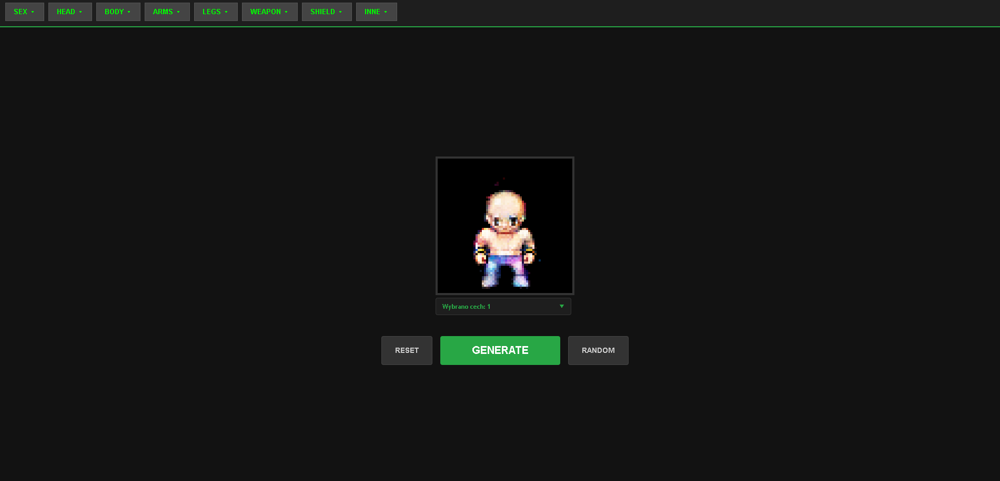
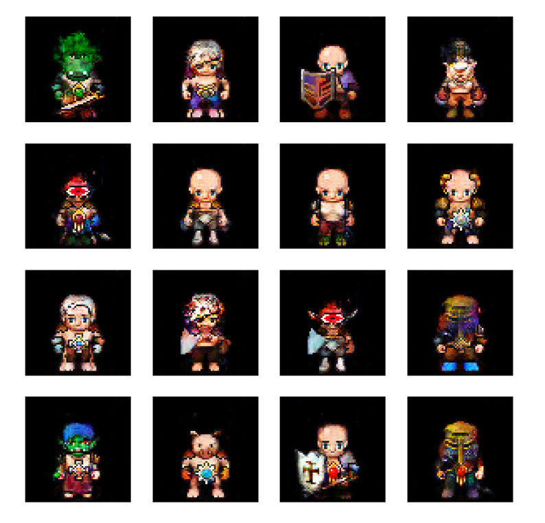

# Pixel-Art AI Generator ⚔️🤖

A generative artificial intelligence application that creates custom RPG-style pixel-art characters using a **Conditional GAN (cGAN)**. Users can select specific character traits (tags), and the AI "forges" a unique sprite based on those inputs.




## 📊 Training Results

Below is a sample grid generated during the final stages of the training process. It showcases the model's ability to interpret different combinations of tags and maintain consistent pixel-art style.



## 🌟 Features

* **Custom Character Forging:** Select gender, hair style, armor type, weapons, and more.
* **Intelligent Tag System:** Built-in logic to prevent conflicting traits (e.g., no simultaneous male/female tags).
* **Smart Defaults:** If a user omits essential traits, the system automatically fills the gaps to ensure a coherent character generation.
* **Real-time Interaction:** Fast generation using a FastAPI backend and a retro-themed web interface.
* **Automatic Background Removal:** Generated sprites are processed to have transparent backgrounds, ready for game engines.

## 🛠️ Technical Stack

* **Deep Learning:** TensorFlow / Keras (Conditional GAN architecture)
* **Backend:** FastAPI (Python)
* **Frontend:** Vanilla JavaScript, CSS3, HTML5
* **Image Processing:** Pillow (PIL)
* **Data Handling:** NumPy, JSON

## 🚀 Installation & Setup

### Prerequisites
* Python 3.10 !
* Git

## 1. Clone the Repository
```bash
git clone [https://github.com/Rucol/Pixel-Art-Generator-v2.git](https://github.com/Rucol/Pixel-Art-Generator-v2.git)
cd Pixel-Art-Generator-v2
```

## 2. Create and Activate Virtual Environment
```bash
python -m venv venv
```
### On windows:
```bash
venv\Scripts\activate
```
### On Linux/MacOS
```bash
source venv/bin/activate
```
## 3. Install Dependencies
```bash
pip install -r requirements.txt
```
## 4. Run the Application
```bash
uvicorn main:app --reload
```
Open your browser and navigate to http://127.0.0.1:8000

## 📁 Project Structure
main.py - FastAPI server and image processing logic.

model_data/ - Contains the trained .keras model and tags dictionary.

static/ - Web interface files (HTML, CSS, JS).

training/ - Original scripts used for model architecture and training.

requirements.txt - List of necessary Python packages.

## 🧠 About the Model
The generator was trained on a custom dataset of pixel-art sprites. It uses a Conditional Generative Adversarial Network where the generator is conditioned on a class vector (tags). This allows for precise control over the visual features of the output image.

## Created by Rucol - 2026


